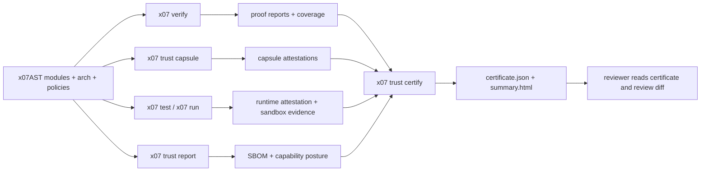

# Formal verification & certification

X07 has two related but different verification surfaces:

- `x07 verify` proves contract properties for the reachable code around one symbol.
- `x07 trust certify` turns proof coverage, boundary metadata, capsule attestations, tests, and runtime evidence into a certificate bundle that reviewers can consume without reading the whole source tree.

The key point is that X07 does not treat "formal verification" as a single-function theorem in isolation. The public trust claim is always tied to a named certification profile and the evidence required by that profile.

## The model



## What X07 proves

### 1. Function and async contracts

`x07 verify` consumes `requires`, `ensures`, `invariant`, `decreases`, and `defasync.protocol` clauses and emits:

- prove reports (`x07.verify.report@0.4.0`)
- reachable coverage (`x07.verify.coverage@0.3.0`)
- standalone imported-summary artifacts (`x07.verify.summary@0.1.0`)

For pure recursive certification, self-recursive `defn` targets are accepted when they declare `decreases[]`. Prove reports expose a `proof_summary` block, and coverage reports expose both recursive summary counters and per-function proof summaries so imported or unsupported graph nodes are visible to reviewers.

Direct prove inputs currently accept unbranded `bytes` / `bytes_view`, first-order `option_*` and `result_*`, and branded `bytes_view` carriers whose brand resolves through reachable `meta.brands_v1.validate`.

That means schema-derived record and tagged-union documents can now sit directly on the proof boundary as `bytes_view@brand`: the generated verify driver runs the validator first and only then materializes the branded view seen by the proof target. Direct `vec_u8` params, owned branded `bytes`, and nested result carriers are still outside the prove-input subset.

When a reviewed callee sits outside the currently loaded graph, emit `verify.summary.json` from its coverage run and pass it back with `x07 verify --summary <path>`. That keeps the imported proof posture explicit in both the coverage artifact and the final certificate/review flow.

For async certification, coverage distinguishes:

- `proven_async`
- `trusted_scheduler_model`
- `capsule_boundary`

Unsupported shapes are rejected with explicit diagnostics instead of being silently treated as trusted.

### 2. Whole-graph certification

`x07 trust certify` is intentionally stricter than "did one proof pass?".

It checks:

- reachable proof coverage for the selected entry
- boundary index completeness
- smoke/PBT resolution
- schema-derive drift
- trust report cleanliness
- dependency-closure attestation when the profile requires it
- compile attestation
- capsule attestations when the profile requires them
- peer-policy evidence and network capsule posture when the profile requires them
- runtime attestation when the profile requires it

If a project keeps extra local helper checks that do not satisfy the
certification profile world or evidence requirements, keep them in a separate
test manifest and point `x07 trust certify` at the certification manifest with
`--tests-manifest`.

### 3. Runtime-backed sandbox claims

For sandboxed certification, the claim is not just about source code. It also binds the observed execution:

- effective policy digest
- network mode and backend enforcement posture
- effective host allowlist / denylist
- bundled binary digest
- compile attestation digest
- capsule attestation digests
- peer-policy digests
- effect-log digests

That is why sandboxed certification requires a supported `run-os-sandboxed` VM backend.

## Certification profiles

The current public profiles are:

| Profile | Intended claim | Key extra requirements |
| --- | --- | --- |
| `verified_core_pure_v1` | pure verified-core entry can be reviewed from the certificate | full reachable proof coverage, no OS effects |
| `trusted_program_sandboxed_local_v1` | sandboxed async entry can be reviewed from the certificate | async proof coverage, capsule attestations, runtime attestation, VM backend, no network |
| `trusted_program_sandboxed_net_v1` | sandboxed networked async entry can be reviewed from the certificate | async proof coverage, attested network capsules, pinned peer policies, dependency-closure attestation, VM-boundary allowlist enforcement |
| `certified_capsule_v1` | effectful capsule is attested and reviewable as a pinned boundary | capsule contract, conformance report, attestation |

## Design decisions

### Profile-first claims

X07 does not make a vague promise that "all x07 programs are formally verified". The claim is always scoped to a profile. That keeps the public guarantee precise and machine-checkable.

### Whole-graph coverage instead of point proofs

The verifier still starts from one entry symbol, but the certification result is about the reachable closure, not a single declaration. Coverage artifacts make the trust boundary explicit instead of hiding imported helpers or capsules.

### Capsules for effect boundaries

Effectful adapters are isolated behind certified capsules. A capsule has:

- a contract
- a conformance report
- an attestation
- a declared effect-log surface

That lets the verified or trusted entry stay small while making the effect boundary reviewable.

### Runtime attestation for sandboxed trust

A sandboxed certificate without runtime evidence is incomplete. The certificate therefore binds the policy, network enforcement posture, binary, compile attestation, and capsule/effect-log evidence to the observed sandbox run.

### Dependency closure is part of the trust claim

Networked certification is also a package-set claim. `x07 pkg attest-closure` records the exact locked dependency set, per-module digests, and advisory/yank posture so `x07 trust certify` can expose the reviewed closure in the certificate instead of treating `x07.lock.json` as an untracked side input.

### Certificate-first review

The intended reviewer workflow is:

1. run `x07 trust certify`
2. inspect `summary.html`
3. inspect `certificate.json`
4. compare changes with `x07 review diff`

That is the reason X07 keeps review artifacts structured and deterministic.

## Starter paths

Start from the scaffold that matches the trust claim you want:

```bash
x07 init --template verified-core-pure
x07 init --template trusted-sandbox-program
x07 init --template trusted-network-service
x07 init --template certified-capsule
x07 init --template certified-network-capsule
```

Canonical examples:

- `docs/examples/verified_core_pure_v1/`
- `docs/examples/trusted_sandbox_program_v1/`
- `docs/examples/trusted_network_service_v1/`
- `docs/examples/certified_capsule_v1/`
- `docs/examples/certified_network_capsule_v1/`
- `x07-mcp/docs/examples/verified_core_pure_auth_core_v1/`
- `x07-mcp/docs/examples/trusted_program_sandboxed_local_stdio_v1/`

The standalone network capsule scaffold reuses `trusted_program_sandboxed_net_v1`; the network trust claim is about the profile posture and required evidence, not a separate capsule-only profile id.

## Where to go next

- [Review & trust artifacts](review-trust.md)
- [CLI](cli.md)
- [Running programs](running-programs.md)
- [Testing](testing.md)
- [Test manifest](tests-manifest.md)
