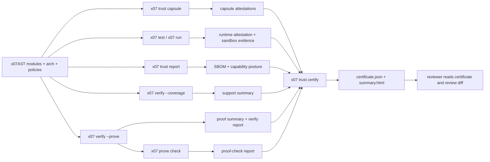

# Formal verification & certification

X07 has three related but different verification surfaces:

- `x07 verify --coverage` classifies reachable support posture around one symbol.
- `x07 verify --prove` emits proof evidence for certifiable reachable symbols.
- `x07 trust certify` turns those proofs, tests, boundaries, capsule attestations, and runtime evidence into a certificate bundle that reviewers can consume without reading the whole source tree.

The key point is that X07 does not treat "formal verification" as a single-function theorem in isolation. The public trust claim is tied to a named certification profile, the operational entry that profile is certifying, and the exact evidence required by that profile.

## The model



## Tooling

The formal-verification surface depends on external solvers. The current Linux release/CI line is validated with:

- `cbmc 6.8.0`
- `z3 4.16.0`

The Ubuntu 24.04 `universe` packages (`cbmc 5.95.1`, `z3 4.8.12`) are too old for the async prove/certify lane: old CBMC emits unsupported `snprintf` warnings during SMT export, and old Z3 times out on the scheduler-model proof even with the current harness. Use the official binaries via `scripts/ci/install_formal_verification_tools_linux.sh`, or mirror what the checked-in example workflows do.

## What X07 proves

### 1. Function and async contracts

`x07 verify` consumes `requires`, `ensures`, `invariant`, `decreases`, and `defasync.protocol` clauses and emits:

- verify reports (`x07.verify.report@0.8.0`)
- reachable coverage/support posture (`x07.verify.coverage@0.4.0`)
- standalone coverage/support summaries (`x07.verify.summary@0.2.0`, `summary_kind = "coverage_support"`)
- standalone proof summaries (`x07.verify.proof_summary@0.2.0`, `summary_kind = "proof"`)
- optional proof objects (`x07.verify.proof_object@0.2.0`)
- optional proof-check reports (`x07.verify.proof_check.report@0.2.0`)

The split matters:

- coverage/support artifacts are planning and review artifacts
- proof summaries are reusable proof evidence
- proof objects plus `x07 prove check` reports are the independently checkable line used by strong trust profiles

`x07 prove check` is a semantic replay checker, not just an artifact-integrity check. It reloads the project manifest, re-resolves the proved declaration, replays imported proof-summary inputs, re-derives the canonical SMT obligation, validates the async scheduler model when present, and requires the replayed solver result to match the proof object.

Coverage reports use support statuses such as `supported`, `supported_async`, and `imported_proof_summary`. They do not count as proof by themselves.
For pure recursive certification, self-recursive `defn` targets are accepted when they declare `decreases[]`. Proof artifacts expose `recursion_kind` and `recursion_bound_kind` so bounded recursion cannot be hidden behind a generic success bit.

Direct prove inputs currently accept unbranded `bytes` / `bytes_view` / `vec_u8`, first-order `option_*` and `result_*`, and branded `bytes_view` carriers whose brand resolves through reachable `meta.brands_v1.validate`.

That means schema-derived record and tagged-union documents can now sit directly on the proof boundary as `bytes_view@brand`: the generated verify driver runs the validator first and only then materializes the branded view seen by the proof target. Direct `vec_u8` params/results are now admitted in the same certifiable subset. Owned branded `bytes` and nested result carriers remain outside the current direct prove-input subset.

When a reviewed callee sits outside the currently loaded graph, emit a proof summary from a successful `x07 verify --prove` run and pass it back with `x07 verify --proof-summary <path>`. Coverage/support summaries are rejected anywhere proof evidence is required. The deprecated `--summary <path>` alias still maps to `--proof-summary`.

Imported primitive stubs are developer-only. Proof runs that depend on `imported_stub` assumptions require `--allow-imported-stubs`, and strong trust profiles reject those assumptions even if a prove run succeeded locally.

For async certification, coverage distinguishes:

- `supported_async`
- `trusted_scheduler_model`
- `capsule_boundary`

Unsupported shapes are rejected with explicit diagnostics instead of being silently treated as trusted.

### 2. Whole-graph certification

`x07 trust certify` is intentionally stricter than "did one proof pass?".

It checks:

- reachable support posture for the selected entry
- per-symbol prove evidence for every symbol the active profile expects to be proved
- boundary index completeness
- smoke/PBT resolution
- schema-derive drift
- trust report cleanliness
- dependency-closure attestation when the profile requires it
- compile attestation
- capsule attestations when the profile requires them
- peer-policy evidence and network capsule posture when the profile requires them
- runtime attestation when the profile requires it

For strong trust profiles it also checks:

- `--entry` matches `project.operational_entry_symbol`
- the certificate is for the operational entry, not a proof-friendly surrogate
- accepted proof inventory items include proof summaries, proof objects, proof-check reports, and proof-check acceptance metadata
- accepted proof assumptions are explicitly disclosed in the certificate
- developer-only imported stubs, coverage-only imports, and bounded recursion are rejected fail-closed
- the certificate tells reviewers whether the operational entry body itself was formally proved, how many symbols were proved, and how much of the trust posture depends on capsule/runtime evidence instead

If a project keeps extra local helper checks that do not satisfy the
certification profile world or evidence requirements, keep them in a separate
test manifest and point `x07 trust certify` at the certification manifest with
`--tests-manifest`.

### 3. Runtime-backed sandbox claims

For sandboxed certification, the claim is not just about source code. It also binds the observed execution:

- effective policy digest
- network mode and backend enforcement posture
- effective host allowlist / denylist
- bundled binary digest
- compile attestation digest
- capsule attestation digests
- peer-policy digests
- effect-log digests

That is why sandboxed certification requires a supported `run-os-sandboxed` VM backend.

## Certification profiles

The current public profiles are:

| Profile | Intended claim | Key extra requirements |
| --- | --- | --- |
| `verified_core_pure_v1` | pure verified-core operational entry can be reviewed from the certificate | per-symbol prove artifacts, proof objects/checks, no OS effects |
| `trusted_program_sandboxed_local_v1` | sandboxed async operational entry can be reviewed from the certificate | async per-symbol prove artifacts, capsule attestations, runtime attestation, VM backend, no network |
| `trusted_program_sandboxed_net_v1` | sandboxed networked async operational entry can be reviewed from the certificate | async per-symbol prove artifacts, attested network capsules, pinned peer policies, dependency-closure attestation, VM-boundary allowlist enforcement |
| `certified_capsule_v1` | effectful capsule is attested and reviewable as a pinned boundary | capsule contract, conformance report, attestation |

## Design decisions

### Profile-first claims

X07 does not make a vague promise that "all x07 programs are formally verified". The claim is always scoped to a profile. That keeps the public guarantee precise and machine-checkable.

### Whole-graph coverage instead of point proofs

The verifier still starts from one entry symbol, but the certification result is about the reachable closure, not a single declaration. Coverage artifacts make the trust boundary explicit instead of hiding imported helpers or capsules, while proof artifacts remain distinct and certifiable.

### Operational-entry certification

The strong claim is about the shipped entrypoint. Strong trust profiles therefore certify the operational entry named in `project.operational_entry_symbol`, not a separate proof-only surrogate.

### Assumption inventory is part of the contract

Certificates now expose proof assumptions directly. Trusted builtins, imported proof summaries, scheduler models, capsule boundaries, and runtime-backed assumptions are inventory items that reviewers can inspect and `x07 review diff` can gate.

### Capsules for effect boundaries

Effectful adapters are isolated behind certified capsules. A capsule has:

- a contract
- a conformance report
- an attestation
- a declared effect-log surface

That lets the verified or trusted entry stay small while making the effect boundary reviewable.

### Runtime attestation for sandboxed trust

A sandboxed certificate without runtime evidence is incomplete. The certificate therefore binds the policy, network enforcement posture, binary, compile attestation, and capsule/effect-log evidence to the observed sandbox run.

### Dependency closure is part of the trust claim

Networked certification is also a package-set claim. `x07 pkg attest-closure` records the exact locked dependency set, per-module digests, and advisory/yank posture so `x07 trust certify` can expose the reviewed closure in the certificate instead of treating `x07.lock.json` as an untracked side input.

### Certificate-first review

The intended reviewer workflow is:

1. run `x07 trust certify`
2. inspect `summary.html`
3. inspect `certificate.json`
4. optionally re-check proof objects with `x07 prove check`
5. compare changes with `x07 review diff`

That is the reason X07 keeps review artifacts structured and deterministic.

## Starter paths

Start from the scaffold that matches the trust claim you want:

```bash
x07 init --template verified-core-pure
x07 init --template trusted-sandbox-program
x07 init --template trusted-network-service
x07 init --template certified-capsule
x07 init --template certified-network-capsule
```

Canonical examples:

- `docs/examples/verified_core_pure_v1/`
- `docs/examples/trusted_sandbox_program_v1/`
- `docs/examples/trusted_network_service_v1/`
- `docs/examples/certified_capsule_v1/`
- `docs/examples/certified_network_capsule_v1/`
- `x07-mcp/docs/examples/trusted_program_sandboxed_local_stdio_v1/` for the strong-profile sandboxed local line
- `x07-mcp/docs/examples/verified_core_pure_auth_core_v1/` for developer/demo proof-summary workflows that depend on a developer-only imported stub path
- `x07-mcp/docs/examples/trusted_program_sandboxed_net_http_v1/` for developer/demo network packaging and capsule flows

The standalone network capsule scaffold reuses `trusted_program_sandboxed_net_v1`; the network trust claim is about the profile posture and required evidence, not a separate capsule-only profile id.

## Where to go next

- [Review & trust artifacts](review-trust.md)
- [CLI](cli.md)
- [Running programs](running-programs.md)
- [Testing](testing.md)
- [Test manifest](tests-manifest.md)
