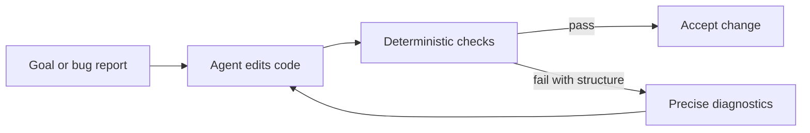
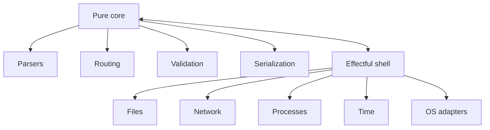

> **Series navigation:** Post 1 of 3 · [Next: How X07 Was Designed for 100% Agentic Coding](/blog/how-x07-was-designed-for-agentic-coding)

For the last twenty years, most programming languages and most software practices were designed around a simple assumption: a human is the one holding the whole thing together.

A human reads code, remembers conventions, notices weirdness, and makes judgment calls when the codebase offers five equally valid ways to solve the same problem.

A coding agent works differently.

It is very good at wide edits. It is very good at following explicit contracts. It is very good at retry loops. But it is much worse than a strong engineer at carrying a large unstated architecture around in its head.

That is why modern programming with coding agents is not normal programming, but faster. It is a different optimization problem.

<!-- truncate -->

Modern agent guidance keeps landing on the same point from different directions: reliability improves when you give the model explicit tools, structured state, reproducible checks, and a concrete finish line instead of vague intent. That is visible in [OpenAI's agent guidance](https://developers.openai.com/tracks/building-agents/) and it lines up with the way X07's own docs push deterministic worlds, architecture checks, test manifests, and review artifacts.

So the practical question becomes:

**How much should we force the agent into a specific design?**

More than we used to force humans, but only where ambiguity creates whole classes of failure.

## Three levers: hard, soft, and conventional

### 1. Hard constraints

Use hard constraints when the alternative is chaos.

These are the things the language or toolchain should enforce because agents predictably fail when they are left open-ended:

* capability boundaries
* one canonical encoding for shared data
* one canonical error model
* resource budgets that are visible and enforced

These are not style choices. They are failure-prevention.

An agent that can mix pure logic with live OS effects everywhere will eventually produce code that is hard to replay, hard to debug, and hard to trust. An agent that can invent data encodings ad hoc will eventually break boundaries. An agent that can "fix performance" by copying and reallocating indiscriminately will eventually blow budgets.

Hard constraints remove bad outcomes from the search space.

### 2. Soft constraints

Use soft constraints when several designs are acceptable, but you still want convergence.

This is where architecture rules, import rules, lint rules, and repo contracts matter:

* pure core modules must not import OS namespaces
* adapter modules belong in effectful targets only
* public APIs need a smoke harness
* external boundaries need pinned encodings
* global mutable state is either banned or tightly constrained

You are not freezing creativity. You are reducing pointless branching.

### 3. Conventions and templates

Use conventions and templates when you want the agent to start from a known-good shape without forbidding better ideas later.

Examples:

* a service scaffold
* one standard CLI library
* one standard streaming composition model
* one standard test manifest
* one standard way to swap fixture adapters for real adapters

For humans, templates are convenience. For agents, they are part of the control plane.

## What changed from human-first design

A lot of older software ceremony existed because humans are slow at search, slow at broad refactors, and often reluctant to touch code outside their immediate area.

That made some habits feel sensible:

* abstraction layers added just in case
* heavy pattern ceremony
* many equivalent coding styles inside one repo
* optimization for local typing convenience

Agents shift that balance.

Agents do not get tired typing. They do not mind broad edits. They are often better than humans at mechanical refactors. So some things become less important:

* pattern vocabulary as a substitute for precise contracts
* future-proofing through extra layers everywhere
* highly personalized coding styles
* architecture that exists mostly in senior engineers' heads

Other things become more important:

* clear module boundaries
* stable interfaces
* deterministic build and test behavior
* structured diagnostics
* reproducible replay
* fitness functions that tell the agent when it is done

That is the shift.

In a human-first codebase, you often optimize for readability by a person who will infer intent.

In an agent-first codebase, you optimize for **repairability** by a system that needs explicit, machine-checkable feedback.



## Contracts over patterns

The programming world has spent decades teaching humans pattern names.

That helped when humans were the primary reasoners.

Agents do better with something else: **contracts**.

A contract says:

* this module may depend on these things, not those things
* this function accepts this shape and returns that shape
* this boundary uses this encoding
* this subsystem must stay under this budget
* this behavior must replay deterministically under fixtures

Patterns are still useful. In an agent-first system, they should be consequences of contracts, not substitutes for them.

:::note
The x07 example below uses the canonical `x07AST` JSON form rather than a C-like surface syntax. Each line is commented because many readers will be new to the language and its toolchain.
:::

```jsonc
{
  "kind": "defn", // Define a pure x07 function.
  "name": "app.core.normalize_path_v1", // Use a stable module-qualified symbol name.
  "params": [
    {"name": "path", "ty": "bytes_view"} // Accept a byte-view path input.
  ],
  "result": "bytes", // Return normalized bytes.
  "requires": [
    {
      "id": "non_empty", // Name the contract clause for diagnostics and review.
      "expr": [">", ["view.len", "path"], 0] // Require at least one byte of input.
    }
  ],
  "body": ["app.core.trim_path_v1", "path"] // Delegate the actual work to a pure helper.
}
```

## Architecture should be data, not folklore

The old way was:

> Everybody knows the core layer should not call the adapter layer.

The agent-first way is:

> Put the architecture in a manifest and make the toolchain prove the repo still matches it.

That turns architecture from documentation into an executable contract.

It also changes what code review is about.

Instead of asking, "Do I like this layout?", you ask, "Did the change stay inside the declared architecture, preserve the contracts, and keep the evidence green?"

## The default shape that fits agents best

The most agent-friendly default is still the simplest one:

* a deterministic functional core
* an effectful shell around it

The reason is not academic purity. The reason is that it makes failures easier to reproduce and fixes easier to validate.

Structured concurrency reinforces the same idea. In [Kotlin's structured concurrency model](https://kotlinlang.org/docs/coroutines-basics.html), child tasks are owned by a parent scope, the parent waits for them, and cancellation propagates predictably. That is easier to reason about than fire-and-forget async work, and the same logic matters even more for coding agents.



This is not the only possible design.

It is the best default because it keeps the part you most want to prove or replay as small and deterministic as possible.

## A practical rule of thumb

If you are building for coding agents, force the things that eliminate whole classes of failure:

* capability boundaries
* canonical encodings
* stable diagnostics
* deterministic replay
* resource budgets

Strongly guide the things where consistency matters:

* module boundaries
* import rules
* public boundary conventions
* test and smoke-harness expectations

Leave the rest open:

* internal decomposition
* local algorithm choices
* within-module refactors

That balance buys the real prize: **agent autonomy without architectural drift**.

:::note
These commands target an x07 codebase. The comments explain what each tool checks and why the output is useful inside an agent repair loop.
:::

```bash
# Check that the repo still matches the declared architecture contract.
x07 arch check --format json

# Run the deterministic project test manifest and fail on behavioral drift.
x07 test --all --manifest tests/tests.json

# Ask the verifier for a bounded proof about one pure x07 function.
x07 verify --bmc --entry app.core.normalize_path_v1
```

That is the entire philosophy in miniature.

Not "please be careful."

Here is how the repo decides whether you are correct.

> **Series navigation:** Post 1 of 3 · [Next: How X07 Was Designed for 100% Agentic Coding](/blog/how-x07-was-designed-for-agentic-coding)
