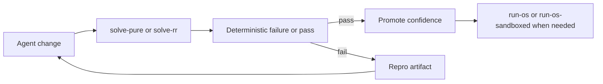
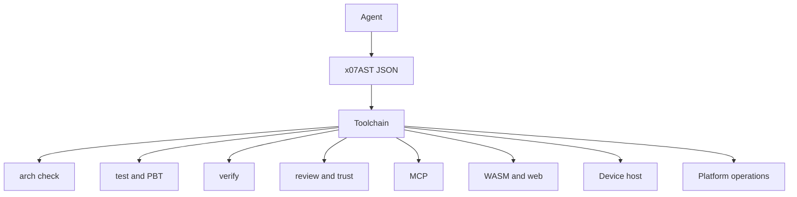

> **Series navigation:** [Previous: Programming With Coding Agents Is Not Human Programming With Better Autocomplete](/blog/programming-with-coding-agents-is-not-human-programming) · Post 2 of 3

Most languages are trying to make humans flexible.

X07 is trying to make agents reliable.

That sounds like a small wording difference, but it changes almost everything: the source format, the diagnostics, the execution model, the testing story, the architecture tooling, and even the surrounding ecosystem.

The [official X07 docs](/docs/) describe an agent-first systems language, and the current toolchain surface is built around deterministic worlds, record and replay, schema derivation, state machines, property-based testing, function contracts with bounded verification, and review or trust artifacts. That is not an AI plugin bolted onto a normal language. It is a language and toolchain shaped around machine-driven repair loops from the start.

<!-- truncate -->

## Why end users should care

Even if you never plan to let an agent write code, the design still matters to you as a user of software built in x07.

* reliable defaults instead of raw-memory footguns
* native runtime targets instead of toy execution
* structured concurrency instead of orphan-task chaos
* one ecosystem that covers CLIs, MCP servers, web UI, device apps, WASM backends, package publishing, and lifecycle operations
* a simpler mental model because there are fewer almost-equivalent ways to do the same thing

That last point is underrated. A simple mental model is a reliability feature.

## 1. Canonical source and patching

The most obvious x07 difference is also one of the most important:

**the canonical source is structured data.**

In x07, the primary source form is `x07AST` JSON, not a text syntax that agents must parse, rewrite, and hope they did not accidentally break. Structural patching then fits naturally with JSON Patch and deterministic canonicalization.

:::note
This example uses x07's canonical `x07AST`-oriented JSON tooling rather than a surface syntax. The comments explain what each field means for readers who are new to the format.
:::

```jsonc
[
  {
    "op": "add", // Apply one structural edit instead of rewriting source text.
    "path": "/decls/3/requires/0", // Address the exact x07AST node by tree position.
    "value": {
      "id": "non_empty", // Give the contract clause a stable diagnostic id.
      "expr": [">", ["view.len", "path"], 0] // Require the path input to contain at least one byte.
    }
  }
]
```

That is fundamentally different from asking an agent to splice text into a language with whitespace conventions, parser gotchas, and multiple competing idioms.

The point is not that JSON is prettier.

The point is that **machines edit trees better than they edit prose**.

## 2. Stable diagnostics instead of guesswork

A normal compiler error is often written for a human: a paragraph of prose plus maybe a hint.

That is not a good interface for an autonomous repair loop.

X07 leans the other way. The public docs emphasize machine-readable diagnostics, stable report schemas, and repair-oriented tooling. That gives agents something structured to key off, humans something concrete to review, and CI something better than brittle text matching. The current toolchain docs make that pattern visible in pages like [`arch check`](/docs/toolchain/arch-check), [`schema derive`](/docs/toolchain/schema-derive), and [`review diff and trust`](/docs/toolchain/review-trust).

## 3. Deterministic worlds and replay

X07's world model is one of the clearest examples of agent-first design.

The official docs split deterministic `solve-*` worlds from real `run-os*` worlds. The deterministic side includes pure compute, fixture-backed filesystem, key-value fixtures, and record or replay, while `run-os` and `run-os-sandboxed` are the explicit escape hatches into live effects. That is exactly what an agent needs if it is going to repair bugs reliably instead of chasing moving targets. See the [worlds overview](/docs/worlds) and the [agent quickstart](/docs/getting-started/agent-quickstart).



In most stacks, nondeterminism is treated as normal and debugging is about coping with it.

In x07, nondeterminism is treated as a boundary you cross on purpose.

## 4. Structured concurrency instead of async sprawl

X07 also chooses one strong default for concurrency.

Its docs explicitly position `task.scope_v1` as structured concurrency with no orphan tasks. That is the same broad rule you see in systems like [Kotlin coroutines](https://kotlinlang.org/docs/coroutines-basics.html): parent scopes own child work, parents wait for children, and cancellation propagates cleanly.

That matters for humans.

It matters even more for agents.

Unstructured async code is hard to test, hard to replay, and hard to review. A coding agent does not need twenty async styles. It needs one clear way to express parallel work that still leaves understandable evidence behind.

## 5. Contracts as normal tooling, not niche extras

In many languages, contracts, property-based testing, schema derivation, state-machine generation, and formal verification feel like advanced extras.

In x07, they are part of the normal toolchain surface:

* `x07 arch check`
* `x07 schema derive`
* `x07 sm`
* `x07 test --pbt`
* `x07 verify --bmc|--smt`
* `x07 review diff`
* `x07 trust report`

That is a strong clue about the worldview behind x07: correctness is not supposed to depend on a hero reviewer reading every line of generated code. It is supposed to be assembled from layered evidence.

## 6. One official path per capability

A big source of failure in agent-written code is not bad reasoning. It is **too many almost-equivalent choices**.

Should the agent use this parser or that one?
This stream abstraction or that one?
This testing pattern or that one?
This deployment shape or that one?

X07 narrows the path on purpose:

* one standard source format
* one standard patch format
* one standard world split
* one standard structured concurrency model
* one standard contracts-as-data story
* one standard trust artifact story

This is not anti-expressiveness.

It is anti-ambiguity.

## 7. The ecosystem keeps the same story all the way out

The surrounding repos reinforce the same direction:

* `x07-mcp` provides the official MCP kit and server story
* `x07-wasm-backend` handles WASM modules and browser packaging
* `x07-device-host` runs the same reducer-style UI model inside desktop and mobile WebViews
* `x07-platform` extends the same trust-first thinking into deploy plans, incidents, and operational controls

That matters because agent reliability usually falls apart at the edges. A language may be neat, but packaging, deployment, browser integration, device runtime, and operations often become unrelated stacks with unrelated rules.

X07 is trying to prevent that fracture. On the interoperability side, it also aligns with the [Model Context Protocol specification](https://modelcontextprotocol.io/specification), which gives agents a standard surface for tools, prompts, and resources.



## A small example of why this works

A human might say:

> Please add a new request field, update validation, keep the API canonical, and do not break determinism.

That is a lot of tacit knowledge.

In x07, the same request can become an explicit finish line:

```bash
# Regenerate validators and related code from the pinned boundary schema.
x07 schema derive --input arch/web/api/service_v1.x07schema.json --out-dir gen --write

# Re-check the declared architecture after the generated code changes.
x07 arch check --write-lock

# Run the deterministic test manifest for the project.
x07 test --all --manifest tests/tests.json

# Produce a human-reviewable intent diff for the patch.
x07 review diff --from baseline --to candidate --html-out target/review/diff.html

# Emit a trust summary for worlds, capabilities, budgets, and sensitive edges.
x07 trust report --project x07.json --out target/trust/trust.json
```

That is the x07 philosophy in one screen.

Turn intention into machine-checkable steps.

The big idea is simple:

**if you want agents to code reliably, stop making them improvise at critical boundaries.**

That is why x07 matters even to users who never think about AI at all. The same design that makes agents more reliable also makes software easier to reason about, easier to replay, easier to review, and easier to operate.

> **Series navigation:** [Previous: Programming With Coding Agents Is Not Human Programming With Better Autocomplete](/blog/programming-with-coding-agents-is-not-human-programming) · Post 2 of 3
