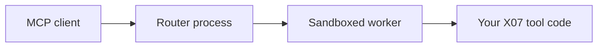

The [Model Context Protocol](https://modelcontextprotocol.io/specification) is how coding agents reach tools and data sources. X07 ships an MCP kit in [`x07-mcp`](/docs/toolchain/mcp-kit), and the `x07` CLI hands template scaffolding and conformance tooling off to it.

This walkthrough uses the HTTP template because you can poke at it with `curl`. Two siblings exist: `mcp-server-stdio` for stdio transport, and `mcp-server-http-tasks` when you need long-running task APIs.

<!-- truncate -->



## Prerequisites

You need:

- macOS or Linux, or Windows through WSL2
- a working C compiler such as `clang` or `gcc`
- about five minutes

## 1. Install X07

```bash
# Install the stable X07 toolchain through x07up.
curl -fsSL https://x07lang.org/install.sh | sh -s -- --yes --channel stable

# Make the X07 shims visible in the current shell session.
export PATH="$HOME/.x07/bin:$PATH"

# Confirm that the CLI is available.
x07 --help
```

If you want a machine-readable environment check after install, run `x07 doctor`.

## 2. Scaffold the HTTP MCP template

```bash
# x07 init scaffolds into the current directory, so make one and step in first.
mkdir my-mcp-http && cd my-mcp-http

# Generate the HTTP MCP server from the template.
x07 init --template mcp-server-http

# Resolve and lock the template's package graph.
x07 pkg lock
```

The generated project includes the pieces you need to get moving:

- `config/mcp.server.json` for the production-shaped server config
- `config/mcp.server.dev.json` for no-auth local development
- `config/mcp.tools.json` for tool declarations
- `src/main.x07.json` for the router entrypoint
- `src/worker_main.x07.json` for the worker entrypoint
- `src/mcp/user.x07.json` for your tool logic
- `tests/tests.json` plus replay fixtures for deterministic checks

## 3. Look at one tool implementation

The scaffold ships with an echo tool. The real one carries more validation and error handling; this trimmed version shows the shape.

:::note
On disk the canonical form is `*.x07.json`. Here it is shown as x07text, the lossless S-expression projection of that JSON, which is easier to read. Run `x07 ast to-text` and `x07 ast from-text` to convert between the two.
:::

```clojure
; x07text
{
  :kind entry
  :module_id mcp.user
  :schema_version x07.x07ast@0.8.0
  :imports ()
  :decls ({:kind defn :name mcp.user._tool_echo_v1 :body (begin (let doc_b (ext.json.data_model.parse args_json)) (let doc (bytes.view doc_b)) (let root (ext.data_model.root_offset doc)) (let k_text (bytes.lit text)) (let text_off (ext.data_model.map_find doc root (bytes.view k_text))) (let text (ext.data_model.string_get doc text_off)) (std.mcp.tool.result.ok_text_v1 (bytes.view text))) :params ({:name args_json :ty bytes_view}) :result bytes}
  )
  :solve (bytes.lit ok)
}
```

The tool parses its JSON arguments, reads the `text` field, and returns it as an MCP text result. The `:solve` line is a placeholder; the real module exports the `defn` and the worker dispatches to it by name.

The contract is what matters: your tool code lives in `src/mcp/user.x07.json`, and the router and worker are already wired around it.

## 4. Bundle the router and the sandboxed worker

The current MCP docs use two bundles: one router process and one worker process.

```bash
# Build the main router binary with real OS access.
x07 bundle --profile os --out out/mcp-router

# Build the worker binary from the worker entrypoint under the sandbox profile.
x07 bundle --profile sandbox --program src/worker_main.x07.json --out out/mcp-worker
```

The template's `config/mcp.server.json` already expects the worker binary at `out/mcp-worker`, so you do not need to change the config if you keep that output path.

## 5. Run the local no-auth dev server

The HTTP template defaults to OAuth for production-shaped behavior. For local development, use the shipped dev config.

```bash
# Start the router with the no-auth development configuration.
X07_MCP_CFG_PATH=config/mcp.server.dev.json ./out/mcp-router
```

The template defaults are:

- bind address: `127.0.0.1:8314`
- MCP path: `/mcp`
- SSE enabled for streamable HTTP

## 6. Initialize it with `curl`

```bash
# Send a minimal MCP initialize request to the local server.
curl -i \
  -H 'Content-Type: application/json' \
  -H 'Accept: application/json,text/event-stream' \
  -H 'Origin: http://localhost:3000' \
  -H 'MCP-Protocol-Version: 2025-11-25' \
  --data '{"jsonrpc":"2.0","id":1,"method":"initialize","params":{"protocolVersion":"2025-11-25","capabilities":{},"clientInfo":{"name":"curl","version":"1"}}}' \
  http://127.0.0.1:8314/mcp
```

At that point you have a running MCP server built from the current X07 template.

## 7. Run the built-in checks

```bash
# Run the template's deterministic test manifest.
x07 test --manifest tests/tests.json

# Check protocol behavior against the MCP conformance harness.
x07 mcp conformance --url http://127.0.0.1:8314/mcp
```

## Where to go next

If you want to keep building:

- use `mcp-server-stdio` for direct stdio transport
- use `mcp-server-http-tasks` when you need `tasks/*`, progress, or resumable task flows
- edit `src/mcp/user.x07.json` to add real tools
- keep `x07 test --manifest tests/tests.json` in your loop so replay fixtures stay deterministic

You start with the architecture in place: a router/worker split, a sandboxed worker, and conformance tooling, instead of bolting those on later.
