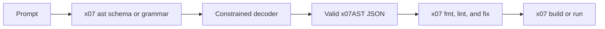

One of the most common failure modes with local code models is not bad logic. It is broken structure.

The model gets close, but the output does not parse, the imports drift, the syntax is incomplete, or the generated file shape is not valid for the target language.

X07 takes a different path: the canonical source format is [x07AST JSON](/docs/language/syntax-x07ast), and the toolchain can export both a JSON Schema and a grammar bundle for that structure. In X07 docs, that export surface is called [Genpack](/docs/genpack/).

That matters for local models because constrained decoding can now target the language's real source form instead of a best-effort textual approximation.

<!-- truncate -->



## Why X07 works well with constrained decoding

The target is not "some text that probably looks like code."

The target is a concrete JSON tree with a published schema, stable versions, and deterministic tooling around it. The current docs expose:

- `x07 ast schema`
- `x07 ast grammar --cfg`
- Python and TypeScript SDK surfaces under `x07-genpack` and `@x07/genpack`

That gives local-model workflows a clean split:

1. constrain the decoder so it can only emit structurally valid x07AST
2. run X07's deterministic formatting and linting passes
3. apply quickfixes where the toolchain can repair the result automatically

## Recipe A: export the X07 schema and compile it with XGrammar

:::note
These commands and host-language snippets are for generating X07 programs. Python is only the glue code around the decoder; the generated language is still X07.
:::

```bash
# Export the canonical X07 AST schema to a local file.
x07 ast schema > /tmp/x07ast.schema.json
```

```python
import pathlib  # Read the exported X07 schema from disk.
import xgrammar as xgr  # Compile decoding constraints for your local model.

schema_str = pathlib.Path("/tmp/x07ast.schema.json").read_text(encoding="utf-8")  # Load the X07 schema bytes as text.
compiler = xgr.GrammarCompiler(tokenizer_info=...)  # Bind the grammar compiler to your model's tokenizer.
compiled = compiler.compile_json_schema(schema_str)  # Produce a decoder constraint that only accepts valid x07AST structure.
```

## Recipe B: export the X07 grammar bundle and use the `min` variant

The grammar bundle is useful when you want the exact shipped grammar variants rather than schema compilation at runtime.

```bash
# Export the X07 grammar bundle with both shipped variants.
x07 ast grammar --cfg > /tmp/x07ast.grammar_bundle.json
```

```python
import json  # Decode the X07 grammar bundle JSON.
import pathlib  # Read the exported bundle from disk.
import xgrammar as xgr  # Compile the selected grammar for your decoder.

bundle = json.loads(pathlib.Path("/tmp/x07ast.grammar_bundle.json").read_text(encoding="utf-8"))  # Load the full X07 grammar bundle.
min_cfg = next(v["cfg"] for v in bundle["variants"] if v["name"] == "min")  # Select the compact grammar variant for smaller or weaker models.
compiler = xgr.GrammarCompiler(tokenizer_info=...)  # Bind the grammar compiler to your tokenizer.
compiled = compiler.compile_grammar(min_cfg)  # Compile the X07 grammar into runtime decoding constraints.
```

The current X07 docs recommend the `min` variant for smaller models and higher-throughput decoding, while `pretty` is mainly for readability and debugging.

## Recipe C: drive the same X07 schema through Outlines

If your local workflow already uses Outlines, the same schema export works there too.

```bash
# Export the canonical X07 schema once for the Outlines generator.
x07 ast schema > /tmp/x07ast.schema.json
```

```python
import pathlib  # Read the exported X07 schema from disk.
import outlines  # Build a schema-constrained generator.

schema_str = pathlib.Path("/tmp/x07ast.schema.json").read_text(encoding="utf-8")  # Load the X07 schema text.
generate = outlines.generate.json(model, schema_str)  # Ask Outlines to constrain generation to valid x07AST JSON.
ast = generate("Generate a valid x07AST module that echoes its input")  # Produce one structurally valid X07 program.
```

## What the model is actually generating

:::note
This tiny example is a real X07 entry program in canonical `x07AST` JSON form. The comments explain the structure for readers who are new to the language.
:::

```jsonc
{
  "schema_version": "x07.x07ast@0.8.0", // Match the current X07 AST schema version.
  "kind": "entry", // Emit a runnable entry program.
  "module_id": "main", // Name the module that owns this entrypoint.
  "imports": [], // This minimal program does not need imported modules.
  "decls": [], // There are no helper declarations in this tiny example.
  "solve": ["view.to_bytes", "input"] // Return the input bytes unchanged.
}
```

That example is intentionally small, but it shows the important point: the target is explicit structure, not free-form source text.

## Converge deterministically after generation

Even with constrained decoding, you still want deterministic cleanup and validation.

```bash
# Canonicalize the generated X07 AST so later diffs are stable.
x07 fmt --input generated.x07.json --write --json

# Collect machine-readable diagnostics for any remaining issues.
x07 lint --input generated.x07.json --json

# Apply any JSON Patch quickfixes that the X07 toolchain can repair automatically.
x07 fix --input generated.x07.json --write --json
```

Inside a full X07 project, [`x07 run`, `x07 build`, and `x07 bundle`](/docs/toolchain/repair-loop) already apply that repair loop automatically by default.

## Why this is especially useful for local models

Local models often have less margin for wasted tokens and less room for syntax retries.

Targeting x07AST directly helps because:

- the output grammar is narrower than a general-purpose text language
- the source form is explicitly machine-editable
- the toolchain returns structured diagnostics and quickfixes
- the repair loop is deterministic

That combination is what makes Genpack interesting. It is not "prompt harder until the syntax looks right." It is "make the language a first-class structured target for the decoder."
