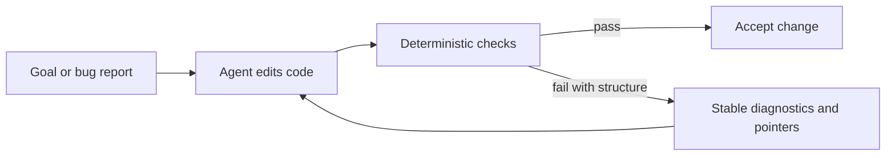

A lot of AI-generated code fails in the same frustrating way: it looks reasonable, maybe even passes a few checks, and then breaks when the real system touches it.

The easy explanation is "the models are not good enough yet."

The harder and more useful explanation is that most programming languages still assume a human is carrying the missing context in their head.

If the language gives the agent five equivalent patterns, prose-only errors, implicit side effects, and flaky test surfaces, the model has to improvise at the exact points where you need it to be mechanical.

That is why recent discussion around agent-first languages matters. Armin Ronacher's essay [A Language For Agents](https://lucumr.pocoo.org/2026/2/9/a-language-for-agents/) made the thesis explicit. My view is slightly more practical: the reliability gap shows up wherever the language and toolchain leave too much ambiguity at the repair boundary.

<!-- truncate -->



## 1. Canonical representation beats stylistic freedom

Most mainstream languages let one team solve the same problem in several equally legal ways.

That is convenient for humans. It is expensive for agents.

A model trained on many styles will keep selecting the most statistically likely pattern, not the one your repo expects. The result is code that is locally plausible but globally wrong for the codebase.

The cleanest fix is to reduce representational ambiguity on purpose.

In X07, the canonical source form is [x07AST JSON](/docs/language/syntax-x07ast), not a text syntax that has to survive string-based edits. That means agents can edit tree structure directly instead of gambling on whitespace and parser recovery.

:::note
This example is based on X07's canonical `x07AST` workflow. The snippet below is an RFC 6902 JSON Patch against an X07 source tree, and each line is commented for readers who are new to the format.
:::

```jsonc
[
  {
    "op": "add", // Apply one structural change instead of rewriting the whole file as text.
    "path": "/decls/3/requires/0", // Target one exact x07AST node by JSON Pointer.
    "value": {
      "id": "non_empty", // Give the contract clause a stable identifier for diagnostics and review.
      "expr": [">", ["view.len", "path"], 0] // Require the input path to contain at least one byte.
    }
  }
]
```

That is a very different editing problem from "insert a guard near line 47 and hope the formatting still parses."

## 2. Diagnostics should be data first

A normal compiler error is often a paragraph written for a human.

That is a weak interface for an autonomous repair loop.

What an agent needs is:

- a stable code
- a precise location
- a suggested structural fix when one exists

X07 leans into that model. The current docs expose [machine-readable diagnostics and the canonical repair loop](/docs/toolchain/repair-loop), where `x07 run`, `x07 build`, and `x07 bundle` automatically iterate through format, lint, quickfix, and retry.

That shift matters because an agent can act on data. It always struggles more when it has to interpret prose.

## 3. Side effects need named boundaries

In most languages, any function might touch the network, the filesystem, the clock, or a subprocess.

That means an agent changing one local function is also making an implicit bet about the whole call graph.

X07 makes that boundary explicit with [worlds](/docs/worlds):

- `solve-pure` for deterministic pure compute
- fixture worlds such as `solve-rr` for deterministic replay
- `run-os` for real OS access
- `run-os-sandboxed` for policy-limited OS access

That does not just help agents. It helps humans reason locally too.

If the edit happens in `solve-pure`, the blast radius is intentionally small.

## 4. Deterministic replay changes the debugging loop

Agents learn from repeatable feedback. Flaky feedback is almost useless.

That is why record/replay matters so much. If a live interaction can be captured once and replayed deterministically, the agent gets the same failure back on the next iteration instead of chasing environmental noise.

X07 treats that as part of the normal toolchain story, not as an afterthought. The [worlds and record/replay docs](/docs/worlds/record-replay) make replayable failure a first-class debugging artifact.

## 5. Local budgets stop small mistakes from becoming expensive incidents

A lot of "agent failure" stories are really "unbounded execution" stories.

The model emits a bad loop or an unnecessary copy path, and then the runtime keeps paying for it until a human notices.

X07 exposes [budget scopes](/docs/language/budget-scopes) as a language primitive so resource limits can live next to the code they protect.

:::note
This example is based on the X07 language itself, using the canonical `x07AST` JSON form. The comments explain what each line means for readers who are not already familiar with X07.
:::

```jsonc
[
  "budget.scope_v1", // Start a local budgeted region inside the current X07 expression tree.
  [
    "budget.cfg_v1", // Describe the policy for this region.
    ["mode", "trap_v1"], // Trap deterministically if the scope exceeds its budget.
    ["label", ["bytes.lit", "parse_headers"]], // Give the budgeted region a stable diagnostic label.
    ["alloc_bytes", 65536], // Cap total allocated bytes inside this scope.
    ["memcpy_bytes", 1048576] // Cap copied bytes inside this scope.
  ],
  ["app.parse_headers_v1", "input"] // Run the actual X07 work inside the local budget.
]
```

The important part is not the exact numbers.

The important part is that the cost boundary is explicit, local, and reviewable.

## A practical checklist

If you want better agent reliability, force the things that remove entire classes of failure:

- one canonical representation for shared code and data
- diagnostics with stable machine-readable structure
- explicit capability boundaries for effects
- deterministic replay for debugging and tests
- local resource budgets

Then be much more selective about where you allow open-ended flexibility.

That is the deeper lesson here. Better prompts help. Better models help. But language and toolchain structure decide how much improvisation the agent has to do in the first place.

X07 is one concrete implementation of that idea, not the only possible one. The broader point is simpler:

**if you want agents to write reliable code, stop forcing them to improvise at critical boundaries.**
