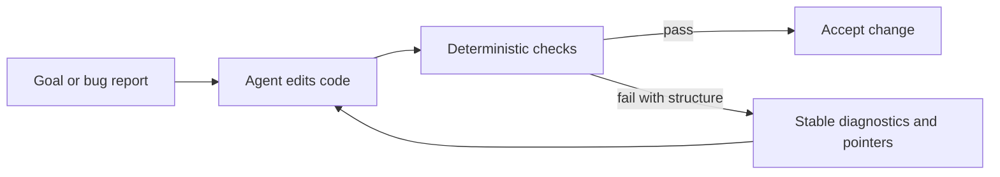

A lot of AI-generated code fails the same way: it looks reasonable, maybe passes a few checks, and then falls apart the moment the real system touches it. The easy explanation is "the models aren't good enough yet." The more useful one is that most languages still assume a human is carrying the missing context in their head.

Hand an agent five equivalent patterns, prose-only errors, implicit side effects, and a flaky test surface, and it has to improvise at exactly the points where you need it to be mechanical.

That is why the recent argument for agent-first languages is worth taking seriously. Armin Ronacher's essay [A Language For Agents](https://lucumr.pocoo.org/2026/2/9/a-language-for-agents/) made the thesis explicit; my own take is a bit more narrow. The reliability gap shows up wherever the language and toolchain leave too much ambiguity at the repair boundary.

<!-- truncate -->


```mermaid
flowchart LR
    A[Goal or bug report] --> B[Agent edits code]
    B --> C[Deterministic checks]
    C -->|pass| D[Accept change]
    C -->|fail with structure| E[Stable diagnostics and pointers]
    E --> B
```

## 1. Canonical representation beats stylistic freedom

Most mainstream languages let one team solve the same problem in several equally legal ways. That is convenient for humans and expensive for agents. A model trained on many styles keeps reaching for the most statistically likely pattern, not the one your repo actually expects, and you get code that is locally plausible but globally wrong for the codebase.

The cleanest fix is to cut the representational ambiguity on purpose.

In X07, the canonical source form is [x07AST JSON](/docs/language/syntax-x07ast), not a text syntax that has to survive string-based edits. That means agents can edit tree structure directly instead of gambling on whitespace and parser recovery.

:::note
This example is based on X07's canonical `x07AST` workflow. The snippet below is an RFC 6902 JSON Patch against an X07 source tree, and each line is commented for readers who are new to the format.
:::

```jsonc
[
  {
    "op": "add", // Apply one structural change instead of rewriting the whole file as text.
    "path": "/decls/3/requires/0", // Target one exact x07AST node by JSON Pointer.
    "value": {
      "id": "non_empty", // Give the contract clause a stable identifier for diagnostics and review.
      "expr": [">", ["view.len", "path"], 0] // Require the input path to contain at least one byte.
    }
  }
]
```

That is a very different editing problem from "insert a guard near line 47 and hope the formatting still parses."

## 2. Diagnostics should be data first

A normal compiler error is a paragraph written for a human. That is a weak interface for an autonomous repair loop. What an agent needs is:

- a stable code
- a precise location
- a suggested structural fix when one exists

X07 leans into that model. The current docs expose [machine-readable diagnostics and the canonical repair loop](/docs/toolchain/repair-loop), where `x07 run`, `x07 build`, and `x07 bundle` automatically iterate through format, lint, quickfix, and retry.

An agent can act on data directly. It struggles the moment it has to interpret prose first.

## 3. Side effects need named boundaries

In most languages, any function might touch the network, the filesystem, the clock, or a subprocess.

That means an agent changing one local function is also making an implicit bet about the whole call graph.

X07 makes that boundary explicit with [worlds](/docs/worlds):

- `solve-pure` for deterministic pure compute
- fixture worlds such as `solve-rr` for deterministic replay
- `run-os` for real OS access
- `run-os-sandboxed` for policy-limited OS access

This is not only an agent affordance. It lets humans reason locally too: if the edit happens in `solve-pure`, the blast radius is intentionally small.

## 4. Deterministic replay changes the debugging loop

Agents learn from repeatable feedback. Flaky feedback is almost useless.

That is why record/replay matters so much. If a live interaction can be captured once and replayed deterministically, the agent gets the same failure back on the next iteration instead of chasing environmental noise.

X07 treats that as part of the normal toolchain story, not as an afterthought. The [worlds and record/replay docs](/docs/worlds/record-replay) make replayable failure a first-class debugging artifact.

## 5. Local budgets stop small mistakes from becoming expensive incidents

A lot of "agent failure" stories are really "unbounded execution" stories. The model emits a runaway loop or a needless copy path, and the runtime keeps paying for it until a human notices.

X07 exposes [budget scopes](/docs/language/budget-scopes) as a language primitive so resource limits can live next to the code they protect.

:::note
The canonical form on disk is `x07AST` JSON. Below it is shown as **x07text**, the lossless S-expression projection from `x07 ast to-text` (and convertible back with `x07 ast from-text`). The budgeted region traps deterministically if it exceeds either cap: 64 KiB of allocation or 1 MiB of copied bytes.
:::

```clojure
; x07text
(budget.scope_v1
  (budget.cfg_v1
    (mode trap_v1)
    (label (bytes.lit parse_headers))
    (alloc_bytes 65536)
    (memcpy_bytes 1048576))
  (app.parse_headers_v1 input))
```

The exact numbers do not matter. What matters is that the cost boundary is explicit, local, and reviewable, sitting right next to the code it constrains.

## What this adds up to

The five sections above are not five unrelated features. They are the same move applied five times: take something a language normally leaves implicit, and make it explicit and mechanical at the point where an agent has to act. Representation, diagnostics, effects, replay, cost. Pin each one down, then be far more selective about where you still allow open-ended flexibility.

Better prompts help. Better models help. But the structure of the language and toolchain decides how much improvisation the agent has to do before either of those even gets a turn.

X07 is one concrete implementation of that idea, not the only possible one. The broader point is simpler:

**if you want agents to write reliable code, stop forcing them to improvise at critical boundaries.**
