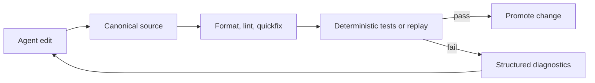

X07 is a compiled systems language built around a simple constraint:

**coding agents are much more reliable when the language and toolchain stop asking them to improvise at critical boundaries.**

Most mainstream languages were optimized for humans carrying context in their heads. Agents work differently. They do better when the source form is canonical, the diagnostics are structured, the effect boundaries are explicit, and the repair loop is deterministic.

That is the design space X07 is exploring.

<!-- truncate -->

## Why X07 exists

The common failure mode with coding agents is not always "nonsense output."

More often, the model produces code that is locally plausible but globally wrong:

- it uses a valid pattern that does not fit the repo
- it patches text in a brittle way
- it misreads a prose error
- it mixes pure logic with live effects
- it passes a weak test and fails in a real environment

X07 tries to reduce those failure modes structurally instead of treating them only as prompt or orchestration problems.



## What is different

### Canonical source format

X07's canonical source form is [x07AST JSON](/docs/language/syntax-x07ast), not a surface syntax that agents have to patch as raw text.

That means structural edits can use RFC 6902 JSON Patch rather than whitespace-sensitive line diffs.

:::note
This example is based on the X07 language itself, using the canonical `x07AST` JSON form. The comments explain what each line means for readers who are new to X07.
:::

```jsonc
{
  "kind": "defn", // Define one pure X07 function.
  "name": "app.core.normalize_path_v1", // Use a stable module-qualified symbol name.
  "params": [
    {"name": "path", "ty": "bytes_view"} // Accept a borrowed byte-view path input.
  ],
  "result": "bytes", // Return owned bytes after normalization.
  "requires": [
    {
      "id": "non_empty", // Name the contract clause so diagnostics and review can reference it.
      "expr": [">", ["view.len", "path"], 0] // Require the input path to contain at least one byte.
    }
  ],
  "body": ["app.core.trim_path_v1", "path"] // Delegate the actual work to a pure helper.
}
```

The point is not that JSON is prettier.

The point is that machines edit trees more reliably than they edit prose.

### Structured diagnostics and repair

The [repair loop](/docs/toolchain/repair-loop) is part of the normal toolchain path.

`x07 run`, `x07 build`, and `x07 bundle` automatically do:

- format
- lint
- apply available quickfixes
- retry

That matters because the toolchain returns structured diagnostics and JSON Patch quickfixes instead of only human-oriented error text.

### Explicit worlds

X07 programs run in explicit [worlds](/docs/worlds):

- `solve-pure` for deterministic pure compute
- fixture worlds such as `solve-rr` for replay
- `run-os` for real OS access
- `run-os-sandboxed` for policy-gated OS access

That makes effect boundaries reviewable instead of implicit.

### Local budgets

X07 exposes [budget scopes](/docs/language/budget-scopes) as a language primitive so cost and resource limits can be pinned close to the code they protect.

### Verification and trust artifacts

The toolchain includes:

- [architecture checks](/docs/toolchain/arch-check)
- [property-based testing](/docs/toolchain/pbt)
- [formal verification and certification](/docs/toolchain/formal-verification)
- [review and trust artifacts](/docs/toolchain/review-trust)

The important nuance is that X07 does not treat "verification" as one big magic claim. The current docs separate coverage, proof, certification, and runtime evidence into different structured outputs.

## A short example of the workflow

:::note
These commands are part of the X07 toolchain. The comments explain what each command contributes to the agent repair loop.
:::

```bash
# Canonicalize the X07 source so later diffs and pointers stay stable.
x07 fmt --input src/main.x07.json --write --json

# Collect machine-readable diagnostics for schema and semantic issues.
x07 lint --input src/main.x07.json --json

# Apply any available JSON Patch quickfixes deterministically.
x07 fix --input src/main.x07.json --write --json

# Run the project-level deterministic test manifest.
x07 test --manifest tests/tests.json
```

## The surrounding ecosystem

The current public X07 stack also includes:

- the [MCP kit](/docs/toolchain/mcp-kit) through `x07-mcp`
- the [WASM and device pipeline](/docs/toolchain/wasm)
- the package registry at [x07.io](https://x07.io)
- [Genpack](/docs/genpack/) for schema- and grammar-constrained generation of valid x07AST
- lifecycle and trust surfaces documented under the platform and trust tooling

The goal is to keep the same "structured contracts first" story all the way out to packaging, deployment, and operations.

## Performance

X07 is still trying to be a practical compiled language, not a toy research system.

The published [`x07-perf-compare`](https://github.com/x07lang/x07-perf-compare) repo includes runnable benchmarks and snapshots. In the February 9, 2026 macOS direct-binary snapshot published there, X07 ran near C and Rust on the included workloads, while warm-cache compile times were about `1.3x-1.8x` faster than C and `3.1x-3.7x` faster than Rust, with binaries around `34 KiB`.

That is one published snapshot on one machine, not a universal guarantee. It is still useful because the repo makes the measurement methodology inspectable.

## Honest status

X07 is under active development.

The language, toolchain, and ecosystem are real and usable today, but the project is still early. APIs will move. Some capabilities are much more mature than others. This is not a claim that X07 has finished solving agent reliability.

The narrower claim is the one I think matters:

**if we want agents to produce more dependable software, the language and toolchain need to expose explicit, machine-checkable structure at the places where failure is expensive.**

If you want to dig deeper:

- [Docs](/docs/)
- [Agent quickstart](/docs/getting-started/agent-quickstart)
- [GitHub](https://github.com/x07lang/x07)
- [Discord](https://discord.gg/59xuEuPN47)
