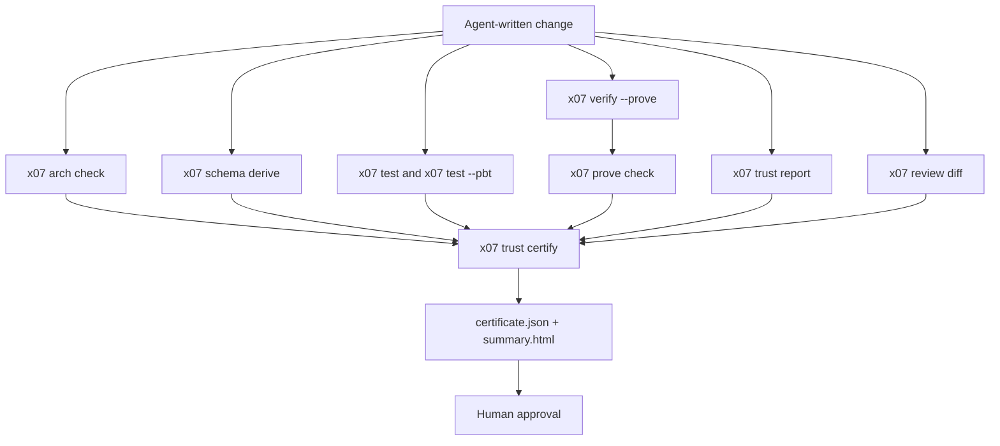
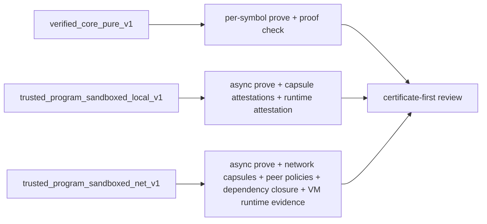

> **Series navigation:** [Previous: How X07 Was Designed for 100% Agentic Coding](/blog/how-x07-was-designed-for-agentic-coding) · Post 3 of 3

Most code written by coding agents should not be trusted on sight.

That is not because agents are useless. It is because normal languages and normal toolchains were built for human review, not for machine-checkable trust. So the default reaction is still, "I need to read the code." X07 changes that by changing what counts as evidence.

Two ideas from other engineering fields make this possible. **Formal verification** means using mathematical proof to show that code does exactly what its specification says — not "we ran some tests and they passed," but "we can prove this function never returns a negative number under any input." **Code certification** takes that further: it bundles proofs, test results, architecture checks, and runtime evidence into a structured package — a certificate — that a reviewer can inspect and approve without reading every line of source. Think of it like a building inspection report: you do not need to watch every nail go in if you trust the inspection process, the inspector's credentials, and the evidence they collected. The idea is not new in principle: Clover showed that verification can act as a strong filter in a closed loop, with up to 87% acceptance on correct CloverBench examples and no false positives on adversarial incorrect ones in that evaluation setting. The lesson is not "trust the model." The lesson is "make the checker honest, explicit, and useful." ([arXiv](https://arxiv.org/abs/2310.17807))

<!-- truncate -->

The most important idea in X07's trust story is this:

**in X07, the thing a human reviews is not just source code. It is a named trust claim plus an evidence bundle.**

The X07 [formal verification docs](/docs/toolchain/formal-verification) describe three distinct verification surfaces. `x07 verify --coverage` tells you what the verifier can support around an entry symbol. `x07 verify --prove` emits proof evidence for certifiable reachable symbols. And `x07 trust certify` turns proofs, tests, boundaries, capsule attestations, dependency evidence, and runtime evidence into a certificate bundle a reviewer can inspect without reading the whole tree. The claim is always tied to a **named certification profile**, the **operational entry** being certified, and the exact evidence required by that profile.

That is the key to understanding trust in X07. You do not trust "all X07 code." You trust a declared profile.

The current public profiles are a good example of that design. `verified_core_pure_v1` is the pure verified-core line. `trusted_program_sandboxed_local_v1` is for sandboxed async programs with no network. `trusted_program_sandboxed_net_v1` is for sandboxed networked async programs, with attested network capsules, pinned peer policies, dependency-closure evidence, and VM-boundary allowlist enforcement. Those are very different claims, and X07 keeps them separate on purpose.

## What makes the trust story concrete

The easy claim would be: "this is a promising trust direction."

The actual claim is stronger:

> **For the declared strong profiles, X07 can give a reviewer enough structured evidence to approve a program without reading the whole source tree.**

That does **not** mean every line in every X07 program is formally proved. The [formal verification docs](/docs/toolchain/formal-verification) explicitly reject that kind of vague promise. The claim is always profile-scoped, operational-entry-scoped, and evidence-scoped. That precision is exactly why the trust story is useful instead of hand-wavy.

## Trust in X07 comes from layers

### 1. Architecture evidence

A lot of bad agent-written code is not locally wrong. It is wrong at the architecture level.

It imports the wrong layer. It smuggles effects into the core. It widens capability posture without making that obvious.

[`x07 arch check`](/docs/toolchain/arch-check) exists to catch that kind of drift. It is deterministic, machine-readable, and able to emit JSON Patch suggestions or apply deterministic repairs with `--write`. Architecture in X07 is not "tribal knowledge." It is data.

That matters because an agent is very good at making broad, mechanically consistent edits. It is much less reliable at preserving unwritten architectural folklore.

### 2. Boundary and format evidence

A huge percentage of real bugs live at boundaries.

Wrong field order. Wrong normalization. Wrong byte interpretation. Hidden format drift. Silent producer/consumer mismatch.

[`x07 schema derive`](/docs/toolchain/schema-derive) turns those boundaries into something much harder to fake. It generates encoders, validators, accessors, and deterministic tests from pinned schemas, and it can fail in `--check` mode if the generated outputs drift. It can also emit starter boundary stubs so public interfaces are cataloged instead of implied.

That is a big deal in an agentic workflow. It means a reviewer does not have to ask, "Does this JSON parser look right?" They can ask, "Is this boundary pinned, derived, validated, and still in sync?"

### 3. Behavioral evidence

Tests still matter. In an agentic system, they matter even more.

X07's [worlds model](/docs/worlds) is designed around that reality. The deterministic fixture worlds like `solve-pure`, `solve-fs`, `solve-rr`, and `solve-kv` are separate from OS worlds, which are explicit, opt-in capability profiles. The point is simple: reproducibility is part of trust.

Property-based testing fits the same pattern. X07's [PBT support](/docs/toolchain/pbt) uses deterministic seeds, budgeted execution, structured failure artifacts, and replayable repro files. That gives an agent a much better repair loop than "one unit test failed somewhere." And it gives a human reviewer a much better question: did this survive generated cases and shrink to a stable counterexample when it failed?

### 4. Formal proof evidence

This is the part people usually mean when they ask, "Can I trust the code without reading it?"

In X07, the answer is no longer just "run a bounded checker and hope." The [formal verification docs](/docs/toolchain/formal-verification) draw a strict line between **support posture** and **proof evidence**.

* `x07 verify --coverage` is for support classification and review posture.
* `x07 verify --prove` is for proof evidence.
* proof summaries are reusable proof evidence
* proof objects plus `x07 prove check` reports are the strong-profile line
* coverage/support summaries do **not** count as proof by themselves.

That split matters more than it sounds.

Older verification systems often collapse too many things into one fuzzy green check. X07 does not. It distinguishes:

* what the verifier can support,
* what was actually proved,
* what assumptions were used,
* and what still depends on runtime or capsule evidence.

The certification side is stricter than a single-function proof. `x07 trust certify` checks per-symbol prove evidence, boundaries, smoke and PBT resolution, schema drift, trust report cleanliness, dependency-closure attestation when required, compile attestation, capsule attestations when required, peer-policy evidence for networked profiles, and runtime attestation for sandboxed profiles. For strong profiles it also requires that the entry matches `project.operational_entry_symbol`, rejects proof-only surrogates, rejects developer-only imported stubs, rejects coverage-only imports, rejects bounded recursion, and exposes whether the operational entry body itself was formally proved.

That is the biggest trust improvement X07 has made.

### 5. Runtime and capsule evidence

For pure code, formal proof can carry a lot of the trust story.

For real programs, it cannot carry all of it.

A program that opens files, talks to the network, or runs inside a sandboxed runtime needs evidence about what actually happened at that boundary. X07 handles that by making capsules and runtime attestations first-class. Sandboxed certification binds the effective policy digest, network posture, allowlists, bundled binary digest, compile attestation digest, capsule digests, peer-policy digests, and effect-log digests to the observed run.

That is why the sandboxed trust profiles are strong without pretending the entire runtime is a pure theorem. The pure core can be proved. The effect boundary can be reviewed, attested, and pinned.

### 6. Human review artifacts

Even when all the lower-level checks are green, a reviewer still needs a human-scale summary.

That is what [`x07 review diff` and `x07 trust report`](/docs/toolchain/review-trust) are for. They produce deterministic review artifacts, and the current `review diff` fail gates go well beyond "did `unsafe` appear?" — they include gates for proof coverage decrease, async proof coverage decrease, assumption-surface widening, dev-only assumption introduction, bounded-proof introduction, operational-entry divergence, capsule and sandbox policy widening, package-set changes, and more. `x07 trust report` adds budgets, capabilities, nondeterminism, and SBOM output.

That is exactly the kind of summary a human wants when they are **not** going to read every generated file.



## What trusting X07 code actually looks like

One critical detail in the design is the role of the **operational entry**.

Strong profiles do not certify a cute proof-only helper. They certify the shipped entry named by `project.operational_entry_symbol`. That is how X07 avoids one of the biggest cheats in formal-methods demos: proving one thing and shipping another.

A minimal flow now looks like this:

:::note
These examples use the X07 toolchain. The comments explain what each field and command does for readers who are new to X07.
:::

```jsonc
{
  "schema_version": "x07.project@0.4.0", // Project manifest schema version.
  "name": "example",                      // Package name.
  "entry": "src/example.x07.json",        // Path to the main X07 source file.
  "operational_entry_symbol": "example.main" // The symbol that must be certified — this is what actually ships.
}
```

```bash
# Validate that the project meets the requirements of the selected trust profile.
x07 trust profile check \
  --profile arch/trust/profiles/verified_core_pure_v1.json \
  --project x07.json \
  --entry example.main

# Generate formal proof evidence for the operational entry.
x07 verify --prove \
  --entry example.main \
  --emit-proof target/prove/example.proof.json

# Independently verify the proof artifact is valid.
x07 prove check \
  --proof target/prove/example.proof.json

# Bundle all evidence into a certificate for human review.
x07 trust certify \
  --project x07.json \
  --profile arch/trust/profiles/verified_core_pure_v1.json \
  --entry example.main \
  --out-dir target/cert
```

And the certificate you review is no longer vague. It can say, in structured form, what profile was claimed, what the operational entry was, what the formal verification scope was, which proof artifacts were used, which assumptions were used, and whether the accepted verdict depended on bounded proof or developer-only assumptions. That is the right level of honesty for source-free review.

An illustrative slice looks like this:

```jsonc
{
  "profile": "verified_core_pure_v1",            // Which trust profile was claimed.
  "operational_entry_symbol": "example.main",     // The shipped entry point being certified.
  "formal_verification_scope": "entry_body",      // What the verifier actually covered.
  "entry_body_formally_proved": true,             // Whether the entry itself was proved, not just its helpers.
  "proof_inventory": [
    {
      "symbol": "example.main",                   // Symbol that was proved.
      "kind": "defn",                             // It is a function definition.
      "result_kind": "proven"                     // Full proof, not bounded or assumed.
    }
  ],
  "proof_assumptions": [],                        // No unproved assumptions were needed.
  "accepted_depends_on_bounded_proof": false,     // The verdict does not rely on depth-bounded proofs.
  "accepted_depends_on_dev_only_assumption": false // No developer-only escape hatches used.
}
```

## What X07 can honestly claim now

Here is the honest version.

X07 still does **not** claim that every X07 program is fully formally proved.

What it can claim is better and more useful:

> **For named strong profiles, X07 can give a human reviewer enough structured evidence to approve the operational entry from the certificate bundle rather than from a full source dive.**

That is a real milestone.

It is also a healthier way to talk about trust. The question is no longer:

> "Do I personally understand every line the agent wrote?"

The better question is:

> "Did this change satisfy the selected certification profile for the operational entry, with the required proof, test, boundary, capsule, dependency, and runtime evidence, and without widening the trust posture?"

That is a better engineering question. It scales better. It is more honest. And it is much closer to the way people will actually need to review code in a world where coding agents do a lot of the writing.



**Up next:** [Building an X07 Service: From Scaffold to Certificate](/blog/building-an-x07-service-from-scaffold-to-certificate) — a practical walkthrough of scaffolding a service, adding contracts, and producing a certificate bundle.

> **Series navigation:** [Previous: How X07 Was Designed for 100% Agentic Coding](/blog/how-x07-was-designed-for-agentic-coding) · Post 3 of 3
