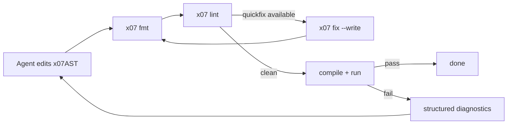
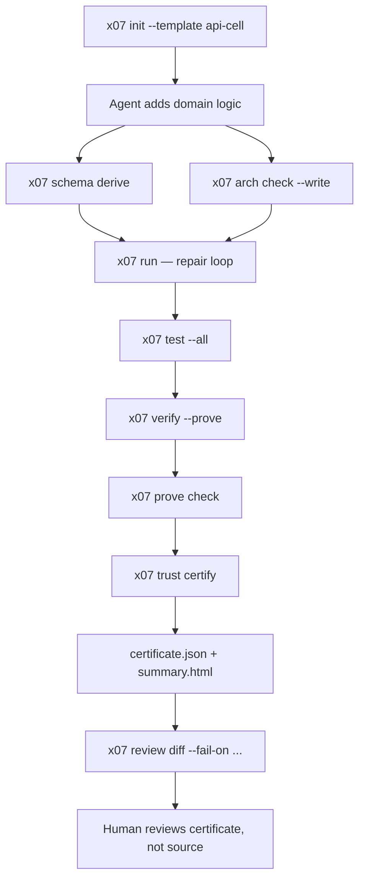

> **Previously:** [How to Trust X07 Code Written by Coding Agents](/blog/how-to-trust-x07-code-written-by-coding-agents)

The previous posts explained *why* X07 exists and how its trust model works. This post walks through *doing* it — scaffolding a service, adding domain logic, wiring tests and contracts, and producing the kind of certificate bundle that lets a reviewer approve a change without reading the whole source tree.

Everything below is something a coding agent can execute in one session. That is the point.

<!-- truncate -->

## Step 1: Scaffold the service

X07 ships service templates that produce a working project in one command. The five built-in archetypes are `api-cell`, `event-consumer`, `scheduled-job`, `policy-service`, and `workflow-service`. Each maps to a specific ingress kind, runtime class, and scale class.

For this walkthrough we will use `api-cell` — an HTTP service backed by Postgres and S3-compatible object storage.

```bash
# Scaffold a new project from the api-cell service archetype.
x07 init --template api-cell --dir orders
cd orders
```

That single command produces a complete, buildable project:

```
orders/
  x07.json                              # project manifest
  x07.lock.json                         # pinned dependency graph
  x07-toolchain.toml                    # toolchain channel + offline docs
  AGENT.md                              # self-recovery guide for agents
  src/
    main.x07.json                       # program entry (wires to the domain)
    example.x07.json                    # starter domain module
  arch/
    manifest.x07arch.json               # architecture rules
    service/
      index.x07service.json             # service manifest (cells, topology, bindings)
  policy/
    run-os.json                         # sandbox policy for run-os-sandboxed
  tests/
    tests.json                          # test manifest
```

The project already runs:

```bash
# Run the scaffolded service inside the default sandbox profile.
x07 run --profile sandbox
```

Nothing interesting happens yet — the starter domain module returns an empty byte buffer. The point is that every piece of infrastructure is already wired and the repair loop works from the first command.

## Step 2: Understand the service manifest

The file `arch/service/index.x07service.json` is the architectural spine of the service. It declares **what** the service is without deciding **how** it gets deployed.

:::note
This JSON is part of the X07 service architecture system. Comments explain each field for readers new to X07.
:::

```jsonc
{
  "schema_version": "x07.service.manifest@0.1.0", // Service manifest format version.
  "service_id": "orders",                          // Unique service identifier.
  "display_name": "Orders",                        // Human-readable name.

  "domain_pack": {
    "id": "orders",                                // The authoring unit agents edit.
    "display_name": "Orders"
  },

  "cells": [
    {
      "cell_key": "api",                           // Unique key for this operational cell.
      "cell_kind": "api-cell",                     // Archetype: HTTP API service.
      "entry_symbol": "orders.api.main",           // The x07AST symbol that handles requests.
      "ingress_kind": "http",                      // Traffic enters over HTTP.
      "runtime_class": "native-http",              // Compiled native binary with HTTP adapter.
      "scale_class": "replicated-http",            // Horizontally scaled behind a load balancer.
      "binding_refs": ["db.primary", "obj.documents"], // Logical dependencies (not cloud products).
      "topology_group": "primary"                  // Co-location hint for topology profiles.
    }
  ],

  "topology_profiles": [
    {
      "id": "dev",
      "target_kind": "hosted",                     // Single deployable for local and hosted dev.
      "placement": "co-located"
    },
    {
      "id": "prod",
      "target_kind": "k8s",                        // Kubernetes with independent cell scaling.
      "placement": "split-by-cell"
    }
  ],

  "resource_bindings": [
    { "name": "db.primary", "kind": "postgres", "required": true },  // Logical Postgres binding.
    { "name": "obj.documents", "kind": "s3", "required": false }     // Logical S3-compatible binding.
  ],

  "default_trust_profile": "sandboxed_service_v1"
}
```

Three things to notice:

1. **Cells are the unit of release and trust.** Each cell has one entry symbol, one ingress kind, one runtime class, and one trust boundary. That is not accidental — it keeps the reviewable surface small.

2. **Bindings are logical.** The service code says `db.primary`, not `postgres://prod-cluster-3.us-east-1.rds.amazonaws.com`. Cloud-specific wiring happens at deploy time, outside the service repo.

3. **Topology is late.** The same domain pack can run as one co-located binary in dev and split into independent Kubernetes deployments in prod. The agent does not need to know which.

```bash
# Validate the service manifest against the archetype schema.
x07 service validate --manifest arch/service/index.x07service.json
```

## Step 3: Add pure domain logic

The most important code in an X07 service lives in the pure domain kernel. This is the part that can be formally verified, deterministically tested, and certified.

:::note
This example uses X07's canonical `x07AST` JSON format. The comments explain what each field means for readers who are new to the language.
:::

```jsonc
{
  "schema_version": "x07.x07ast@0.8.0",          // x07AST format version.
  "kind": "module",                                // This file defines an x07 module.
  "module_id": "orders.core",                      // Fully qualified module name.
  "imports": [],                                   // No external dependencies — pure logic only.
  "decls": [
    {
      "kind": "defn",                              // Define a pure, synchronous function.
      "name": "orders.core.compute_total_v1",      // Stable module-qualified symbol name.
      "params": [
        { "name": "item_count", "ty": "i32" },    // Number of items in the order.
        { "name": "unit_price", "ty": "i32" },    // Price per item in cents.
        { "name": "discount_pct", "ty": "i32" }   // Discount percentage (0-100).
      ],
      "result": "i32",                             // Returns the total in cents.

      "requires": [
        { "id": "valid_count",    "expr": [">=", "item_count", 0] },
        { "id": "valid_price",    "expr": [">=", "unit_price", 0] },
        { "id": "bound_discount", "expr": ["and",
            [">=", "discount_pct", 0],
            ["<=", "discount_pct", 100]] }
      ],

      "ensures": [
        { "id": "non_negative", "expr": [">=", "__result", 0] }
      ],

      "body": ["begin",
        ["let", "subtotal", ["*", "item_count", "unit_price"]],
        ["let", "reduction", ["/", ["*", "subtotal", "discount_pct"], 100]],
        ["-", "subtotal", "reduction"]
      ]
    },
    {
      "kind": "export",                            // Make the symbol visible to other modules.
      "names": ["orders.core.compute_total_v1"]
    }
  ]
}
```

A few things worth pointing out:

- **`requires` and `ensures` are contracts, not comments.** They are machine-checkable and the verifier uses them as proof obligations. The `id` on each clause gives diagnostics and review artifacts a stable name to reference.

- **The body is an expression tree, not text.** An agent does not need to parse indentation or deal with syntax ambiguity. It edits a tree, and the toolchain validates the tree.

- **There are no imports.** This function is pure — it depends on nothing outside its own parameters. That purity is what makes formal verification practical rather than aspirational.

## Step 4: Pin the boundary

A pure function is not useful until something calls it. The boundary between the pure kernel and the outside world is where most bugs live — wrong field order, wrong encoding, silent format drift.

X07 pins that boundary explicitly:

```bash
# Generate validators, encoders, and deterministic tests from the API schema.
x07 schema derive \
  --input arch/web/api/orders_v1.x07schema.json \
  --out-dir gen \
  --write
```

And the architecture manifest declares which modules belong to which trust zones:

```jsonc
{
  "schema_version": "x07.arch.manifest@0.3.0",
  "repo": { "id": "orders", "root": "." },

  "externals": {
    "allowed_import_prefixes": ["std."],            // Only standard library imports allowed.
    "allowed_exact": ["std.test"]
  },

  "nodes": [
    {
      "id": "domain_core",                          // The pure domain kernel.
      "match": { "path_globs": ["src/orders/core/**/*.x07.json"] },
      "world": "solve-pure",                        // Must run in the deterministic pure world.
      "trust_zone": "verified_core",                // Eligible for formal verification.
      "imports": {
        "deny_prefixes": ["std.os.", "ext."],       // No OS or external imports allowed.
        "allow_prefixes": ["orders.core", "std."]
      }
    },
    {
      "id": "service_shell",                        // The effectful adapter layer.
      "match": { "path_globs": ["src/orders/api/**/*.x07.json"] },
      "world": "run-os-sandboxed",                  // Runs with real OS access under sandbox policy.
      "trust_zone": "untrusted"                     // Reviewed via capsule attestation, not proof.
    },
    {
      "id": "tests",
      "match": { "path_globs": ["tests/**/*.x07.json"] },
      "world": "solve-pure",
      "trust_zone": "test_only"
    }
  ],

  "rules": [
    { "kind": "layers_v1", "id": "layers.v1",
      "layers": ["domain_core", "service_shell", "tests"],
      "direction": "down" },                        // Tests can import service_shell, not the reverse.
    { "kind": "deny_cycles_v1", "id": "no_cycles", "scope": "nodes" }
  ],

  "checks": {
    "deny_cycles": true,
    "deny_orphans": true,
    "enforce_visibility": true,
    "enforce_world_caps": true,
    "allowlist_mode": { "enabled": true }
  }
}
```

```bash
# Validate the architecture rules. Fix any violations deterministically.
x07 arch check --write
```

This is where X07 catches the kind of mistake that an agent makes most often: importing the wrong layer, smuggling effects into the core, or widening capability posture without making it obvious. The architecture manifest turns those implicit rules into data the toolchain can enforce.

## Step 5: The agent repair loop

The normal development loop in X07 is: edit, run, watch the repair cycle.

```bash
# Run the project with auto-repair enabled (the default).
# The toolchain will format, lint, apply quickfixes, and retry automatically.
x07 run
```

Under the hood, `x07 run` does this:



Every diagnostic is structured JSON, not a paragraph of prose. Every quickfix is a JSON Patch the agent can apply mechanically. The loop converges or produces a clear error an agent can parse — there is no "guess what the compiler meant" step.

When the repair loop is not the right tool (for example, when debugging a logic error), turn it off:

```bash
# Run without auto-repair — see raw diagnostics instead.
x07 run --repair=off
```

## Step 6: Tests — smoke and property-based

X07 keeps all test configuration in one manifest:

:::note
This test manifest uses the X07 testing system. Comments explain each field.
:::

```jsonc
{
  "schema_version": "x07.tests_manifest@0.2.0",
  "tests": [
    {
      "id": "smoke/compute_total",                 // Human-readable test identifier.
      "entry": "tests.core.smoke_compute_total",   // The x07AST symbol that runs this test.
      "expect": "pass",                            // Expected outcome.
      "world": "solve-pure"                        // Run deterministically — no OS, no randomness.
    },
    {
      "id": "pbt/total_non_negative",              // Property-based test identifier.
      "entry": "tests.core.pbt_total_non_negative",
      "expect": "pass",
      "world": "solve-pure",
      "returns": "bytes_status_v1",                // PBT functions return a structured status byte.
      "pbt": {
        "cases": 64,                               // Generate 64 random test cases.
        "max_shrinks": 32,                         // Shrink counterexamples up to 32 times.
        "params": [
          { "name": "item_count", "gen": { "kind": "i32", "min": 0, "max": 1000 } },
          { "name": "unit_price", "gen": { "kind": "i32", "min": 0, "max": 100000 } },
          { "name": "discount_pct", "gen": { "kind": "i32", "min": 0, "max": 100 } }
        ],
        "case_budget": {
          "fuel": 100000,                          // Max computation steps per case.
          "timeout_ms": 250,                       // Wall-clock timeout per case.
          "max_mem_bytes": 16777216                 // 16 MB memory cap per case.
        }
      }
    }
  ]
}
```

```bash
# Run all tests — both smoke and PBT.
x07 test --all --manifest tests/tests.json
```

The PBT test generates random inputs within the declared ranges, runs the function, checks the contract postconditions, and if anything fails, shrinks to the smallest counterexample. That gives a reviewer a much better question than "did the tests pass?" — the question becomes: *did this function survive 64 generated cases across the full input space and produce a stable, minimal counterexample when it failed?*

If PBT finds a counterexample:

```bash
# Replay the exact failing case for debugging.
x07 test --pbt --pbt-repro target/x07test/pbt/total_non_negative/repro.json \
  --manifest tests/tests.json

# Apply the structured fix if one is available.
x07 fix --from-pbt target/x07test/pbt/total_non_negative/repro.json --write
```

## Step 7: Formal verification

Tests show that the function works on the cases you tried. Formal verification shows that the contracts hold *for all inputs*.

```bash
# Check what the verifier can reason about for this entry symbol.
x07 verify --coverage --entry orders.core.compute_total_v1

# Generate proof evidence.
x07 verify --prove \
  --entry orders.core.compute_total_v1 \
  --emit-proof target/prove/compute_total.proof.json

# Independently check the proof artifact.
x07 prove check --proof target/prove/compute_total.proof.json
```

Three commands, three distinct things:

1. **Coverage** tells you what the verifier can support — which symbols are reachable, which have contracts, and which fall outside the certifiable subset.

2. **Prove** generates actual proof evidence: the verifier explores all reachable paths and checks that every `requires`/`ensures` contract holds. The output is a structured proof object, not a vague "verified" badge.

3. **Prove check** independently replays the proof. This is a separate verification step so you do not have to trust the prover — you trust the checker.

The distinction matters. Older verification tools often collapse these into one fuzzy green checkmark. X07 keeps them separate because different trust claims need different evidence.

## Step 8: Certify

Proof is one layer. Certification bundles *all* the evidence — proof, tests, architecture, boundaries, schemas, trust posture — into one reviewable package.

```bash
# Validate the project against the trust profile first.
x07 trust profile check \
  --profile arch/trust/profiles/verified_core_pure_v1.json \
  --project x07.json \
  --entry orders.core.compute_total_v1

# Bundle all evidence into a certificate.
x07 trust certify \
  --project x07.json \
  --profile arch/trust/profiles/verified_core_pure_v1.json \
  --entry orders.core.compute_total_v1 \
  --out-dir target/cert
```

The output lands in `target/cert/`:

```
target/cert/
  certificate.json        # The structured verdict
  summary.html            # Human-readable overview
  boundaries.report.json  # Boundary index validation
  tests.report.json       # Test execution results
  verify.coverage.json    # What the verifier covered
  prove/                  # Per-symbol proof artifacts
  trust.report.json       # Trust posture summary
  compile.attest.json     # Compile attestation
```

## Step 9: What the certificate actually says

The `certificate.json` is the thing a reviewer reads instead of the source tree:

:::note
This is an X07 trust certificate. Comments explain what each field means for the review decision.
:::

```jsonc
{
  "profile": "verified_core_pure_v1",                    // Which trust profile was claimed.
  "operational_entry_symbol": "orders.core.compute_total_v1", // The actual function being certified.
  "formal_verification_scope": "entry_body",             // The verifier covered the entry body itself.
  "entry_body_formally_proved": true,                    // The entry was proved, not just its helpers.

  "proof_inventory": [
    {
      "symbol": "orders.core.compute_total_v1",          // Symbol that was proved.
      "kind": "defn",                                    // It is a pure function definition.
      "result_kind": "proven"                            // Full proof — not bounded or assumed.
    }
  ],

  "proof_assumptions": [],                               // No unproved assumptions were needed.
  "accepted_depends_on_bounded_proof": false,            // Verdict does not rely on depth-bounded proofs.
  "accepted_depends_on_dev_only_assumption": false       // No developer-only escape hatches used.
}
```

That is not vague. It tells the reviewer:

- **What profile was claimed** — `verified_core_pure_v1` means pure, verified core with no OS effects.
- **What was actually proved** — the operational entry body, not a surrogate helper.
- **What assumptions were used** — none in this case.
- **Whether the verdict depends on bounded proofs or dev-only assumptions** — it does not.

A reviewer can approve this without reading the function body. The evidence chain is: contracts on the function → proof that the contracts hold for all inputs → independent proof check → certificate that binds the proof to the operational entry. Each link is structured and machine-checkable.

## Step 10: The review gate

Before merging, run the review diff to catch trust regressions:

```bash
# Produce a semantic diff between the baseline and the candidate.
x07 review diff \
  --from baseline \
  --to candidate \
  --html-out target/review/diff.html \
  --json-out target/review/diff.json \
  --fail-on proof-coverage-decrease \
  --fail-on assumption-surface-widen \
  --fail-on bounded-proof-introduced \
  --fail-on operational-entry-diverges \
  --fail-on sandbox-policy-widen

# Emit a trust summary with budgets, capabilities, and SBOM.
x07 trust report \
  --project x07.json \
  --out target/trust/trust.json \
  --html-out target/trust/trust.html
```

The `--fail-on` flags are CI gates. They catch things like: proof coverage went down, a new assumption was introduced, a bounded proof replaced a full proof, the operational entry changed without updating the profile, or the sandbox policy was widened. Those are exactly the trust regressions a human would miss in a code review of generated files.

## The full pipeline in one diagram



## What this changes about agent-written services

Without this pipeline, reviewing an agent-written service means reading every generated file — the domain logic, the adapters, the configuration, the test fixtures, all of it. That does not scale.

With this pipeline, the reviewer's job changes. Instead of reading source, they read the certificate bundle and the review diff. The questions become:

- Did the operational entry pass formal verification with no bounded proofs or dev-only assumptions?
- Did the test suite — including property-based tests — pass on the full input space?
- Did the architecture check enforce the trust zone boundaries?
- Did the sandbox policy stay within bounds?
- Did proof coverage increase or at least hold steady?

Those are answerable from the artifacts. They do not require the reviewer to understand every line of x07AST JSON.

That is the whole point.

**The code can be written by an agent. The evidence that the code is correct can be checked by a human — or by another agent — from the certificate bundle alone.**

If you want to try it:

- [Docs](/docs/)
- [Agent quickstart](/docs/getting-started/agent-quickstart)
- [Service architecture guide](/docs/guides/x07-service-architecture-v1)
- [Formal verification & certification](/docs/toolchain/formal-verification)
- [GitHub](https://github.com/x07lang/x07)
- [Discord](https://discord.gg/59xuEuPN47)
